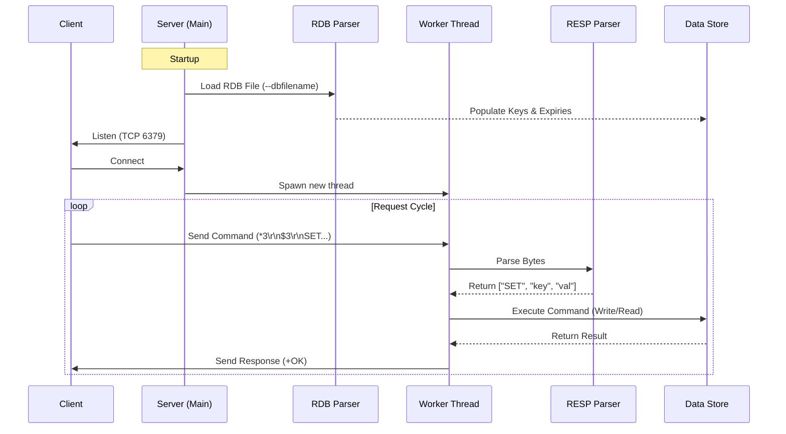

# Build Your Own Redis (Python)

A lightweight, multi-threaded Redis server implementation in Python. This project aims to replicate the core functionality of Redis, including the RESP protocol, key-value storage, and handling concurrent client connections, serving as a deep dive into network programming and database internals.

## 🚀 Project Status
**Current Phase: Phase 4 (Persistence via RDB)**
The server is now capable of configuring storage locations (`CONFIG GET`), handling key expiration (`PX` or via RDB), and loading persistent data from RDB files on startup.

## ✨ Features
- **TCP Server**: Listens on `localhost:6379`.
- **Concurrency**: Multi-threaded architecture to handle multiple clients simultaneously.
- **Redis Protocol (RESP)**:
    - [x] Responds to `PING` with `+PONG`.
    - [x] Full RESP Parsing (Arrays, Bulk Strings).
- **Storage Engine**:
    - [x] In-memory Key-Value Store (`SET`, `GET`).
    - [x] Key Expiration (`PX` argument).
    - [x] **RDB Persistence**: Loads data from `dbfilename` in `dir` on startup.
    - [x] **Configuration**: Supports `CONFIG GET`.
    - [x] **Inspection**: Supports `KEYS *`.
- **Cross-Platform**: Tuned to work on Windows and Linux (socket reuse options handled).

## 🛠️ How to Run

### Prerequisites
- Python 3.8+

### Start the Server
You can run the server directly using Python. You can specify the RDB directory and filename.

```bash
# Default (Current directory, dump.rdb)
python -m app.main

# With custom persistence location
python -m app.main --dir /tmp/redis-data --dbfilename my.rdb
```

Or use the provided helper script (Linux/Git Bash):
```bash
./your_program.sh --dir /tmp --dbfilename dump.rdb
```

### Test Connectivity
You can connect using `netcat` or `redis-cli`:

```bash
$ redis-cli ping
PONG

$ redis-cli config get dir
1) "dir"
2) "/tmp/redis-data"

$ redis-cli keys *
1) "my_saved_key"
```

### 🖥️ Native CLI Tool (Included)
If you don't have `redis-cli` installed, you can use the included Python CLI:

```bash
python cli.py
```
It supports interactions like:
```text
127.0.0.1:6379> SET name aryan px 5000
OK
127.0.0.1:6379> KEYS *
1) "name"
```

## 🏗️ Architecture
The server follows a multi-threaded request-response model with an initialization phase for persistence:



**Key Components:**
1.  **Transport Layer**: `socket` + `threading` handles concurrent connections.
2.  **Protocol Layer**: `RESPParser` decodes raw bytes into Python lists.
3.  **Persistence Layer**: `RDBParser` reads Redis RDB version 9 files to restore state on boot.
4.  **Command Layer**: A dispatcher routes commands (`PING`, `SET`, `GET`, `ECHO`, `CONFIG`, `KEYS`) to their handlers.
5.  **Storage Layer**: A thread-safe global dictionary holds data with optional expiry timestamps.

## 🗺️ Roadmap
- [x] **Phase 1**: Networking foundation & Concurrency (Threaded Server)
- [x] **Phase 2**: Command Parsing (`ECHO`, `SET`, `GET`) & Storage Engine
- [x] **Phase 3**: Key Expiry (`PX` argument)
- [x] **Phase 4**: Persistence (RDB Loading, `CONFIG GET`, `KEYS *`)
- [ ] **Phase 5**: Advanced Features (RDB Saving, Replication)

## 🤝 Contributing
This is an educational project. Feel free to fork and build your own!
